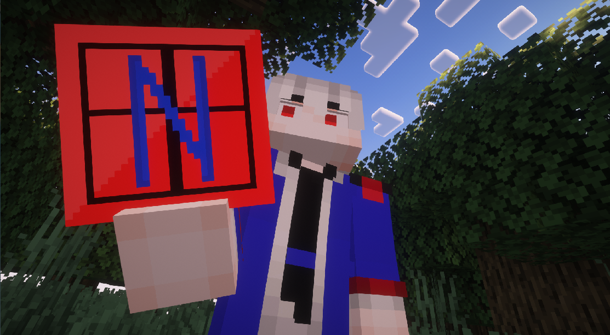
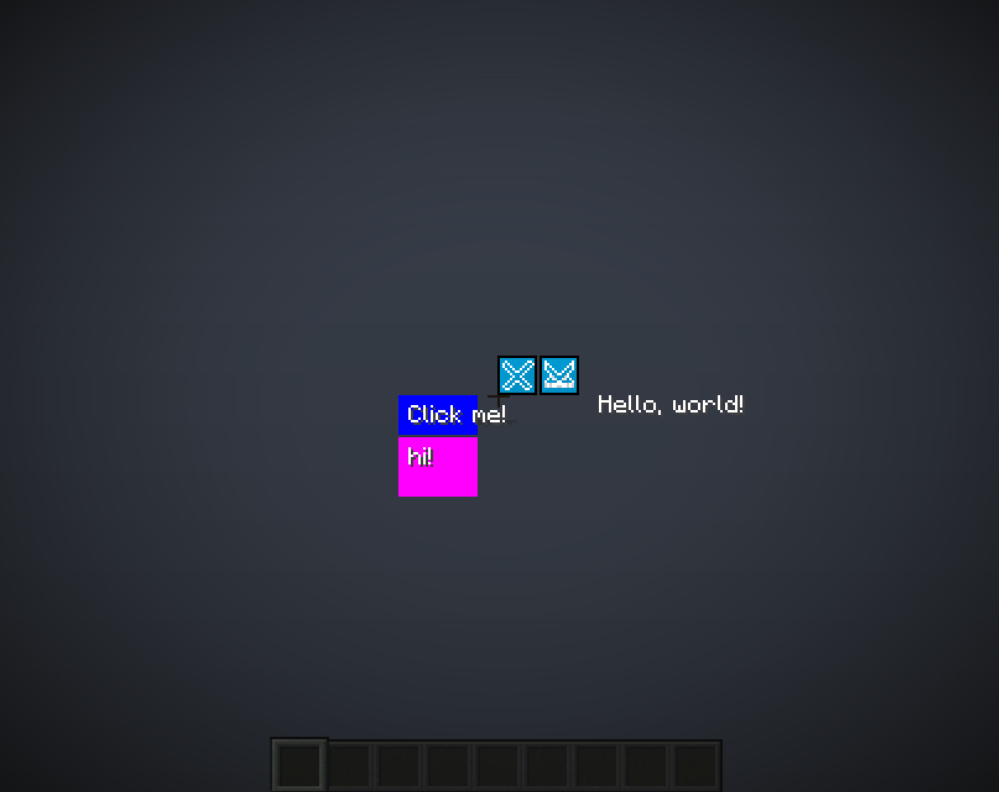

# NoxaFrame

NoxaFrame is a lightweight UI framework for Minecraft modding.

The library provides a simple layout system built around containers and UI elements, allowing developers to construct interfaces using rows, columns, icons, buttons, and other components.

Key ideas behind NoxaFrame:

* Simple layout containers (Row / Column)
* Relative and absolute positioning
* Rendering abstraction through `IRenderContext`

The framework focuses on giving mod developers a structured way to build interfaces

## License
This project is licensed under MPL-2.0.

## Versioning
NoxaFrame uses the following version format:

X.Y-A

X – generation of the framework;
Y – version inside the generation;
A – stage of the release.

Stages:
N – private development version;
A – alpha;
B – beta;
R – public stable release;
C – limited distribution;
D – special build for specific projects.

The @since tag always refers to the first public version (A/B/R).

## Example
```java
UIRowContainer row = new UIRowContainer(4);
row.xy(0.5f, 0.5f).wh(100, 100);
UIIcon icon = new UIIcon(IconManager.getIcon(IconManager.test));
icon.wh(16, 16);
row.addChild(icon);
root.addChild(row);
```
You have see 'dev.nalan_tttt.noxaframe.client.framework.TestGUI' for a full example GUI.
This is what the TestGUI looks like:


## How to use NoxaFrame
In repositories:
```groovy
repositories {
    mavenCentral()
    maven { url 'https://jitpack.io' }
}
```
in dependencies:
```groovy
dependencies {
    modImplementation "com.github.Nalan3333:NoxaFrame:${noxaframe_version}"
}
```
And in gradle.properties:
```properties
noxaframe_version=???
```
Replace ??? with the NoxaFrame version.
## Status
The project is currently under active development.
